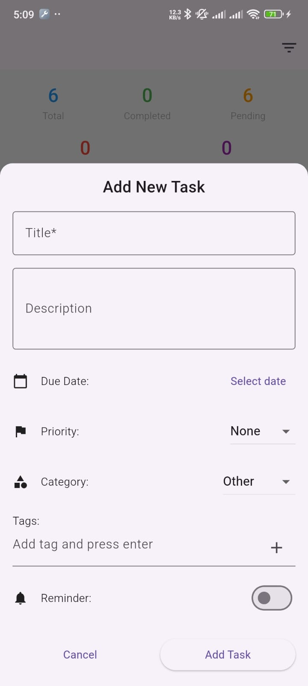
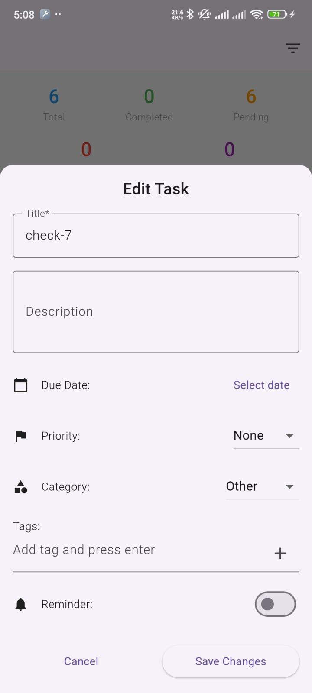
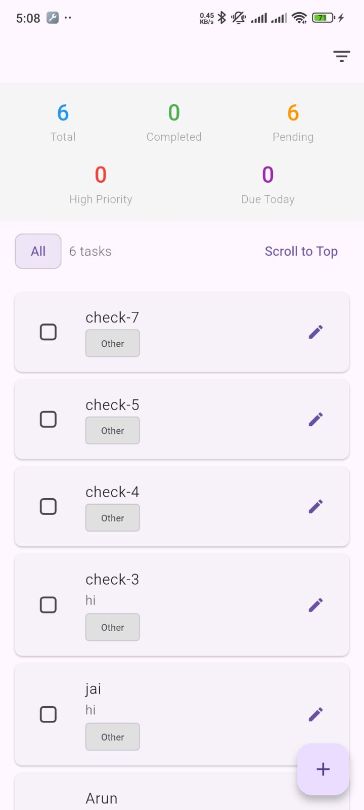

# Task Management App

A comprehensive Flutter-based task management application that helps users organize their tasks with various features like categories, priorities, due dates, reminders, and tags.

## Features



### Core Functionality
- ✅ **Task Management**: Create, read, update, and delete tasks
- ✅ **Task Completion**: Mark tasks as complete/incomplete with toggle functionality
- ✅ **Categories**: Organize tasks into personal, work, study, health, shopping, or other categories
- ✅ **Priorities**: Set task priority levels (none, low, medium, high)
- ✅ **Due Dates**: Add due dates with visual indicators for overdue and due-today tasks
- ✅ **Tags**: Add custom tags to tasks for better organization
- ✅ **Reminders**: Set reminder dates and times for important tasks

### User Interface
- ✅ **Responsive Design**: Works on both mobile and tablet devices
- ✅ **Filter System**: Filter tasks by status (all, pending, completed), priority, due date
- ✅ **Statistics Dashboard**: View task counts for total, completed, pending, high priority, and due today tasks
- ✅ **Search Functionality**: Search tasks by title, description, or tags
- ✅ **Swipe Actions**: Swipe left/right to complete or delete tasks
- ✅ **Visual Indicators**: Color-coded chips for priorities, due dates, and categories

### Data Persistence
- ✅ **Local Storage**: Tasks are saved locally using SharedPreferences
- ✅ **Data Integrity**: Error handling for data loading and saving operations

## Getting Started

### Prerequisites
- Flutter SDK (latest stable version)
- Dart SDK
- Android Studio or VS Code with Flutter extension

### Installation

1. Clone the repository:
```bash
git clone https://github.com/arunlatha231701/todoapp.git
cd todoapp
```

2. Install dependencies:
```bash
flutter pub get
```

3. Run the application:
```bash
flutter run
```

## Project Structure

```
lib/
├── models/
│   └── task.dart          # Task data model with enums and serialization
├── providers/
│   └── task_provider.dart # State management using ChangeNotifier
├── screens/
│   └── home_screen.dart   # Main application screen
├── widgets/
│   ├── add_task_dialog.dart    # Dialog for adding new tasks
│   ├── category_filter.dart    # Filter selection widget
│   ├── edit_task_dialog.dart   # Dialog for editing existing tasks
│   ├── task_list.dart          # List view of tasks
│   ├── task_stats.dart         # Statistics display widget
│   └── task_tile.dart          # Individual task item widget
└── main.dart              # Application entry point
```

## Usage

### Adding a Task
1. Tap the floating action button (+) on the home screen
2. Fill in the task details:
    - Title (required)
    - Description (optional)
    - Due date (optional)
    - Priority level
    - Category
    - Tags (press Enter after each tag)
    - Reminder (toggle and set date/time)
3. Tap "Add Task" to save

### Managing Tasks
- **Complete/Incomplete**: Tap the checkbox or the task itself
- **Edit**: Tap the edit icon on any task
- **Delete**: Swipe right on a task and tap delete, or use the clear completed button in the app bar
- **Filter**: Use the filter icon in the app bar to view different task categories

### Task Organization
- Use categories to group related tasks
- Set priorities to identify important tasks
- Add tags for cross-category organization
- Set due dates to track deadlines
- Use reminders for time-sensitive tasks

## Testing

The application includes comprehensive tests:

### Model Tests
- Task creation with default values
- Task completion toggle functionality
- Due date validation (overdue, due today)
- Serialization and deserialization
- Copy-with functionality

### Widget Tests
- Task tile displays correct information
- Completed task styling
- Checkbox interaction
- Tag display limitations

Run tests with:
```bash
flutter test
```

## Dependencies

- `flutter_slidable`: For swipe actions on task items
- `intl`: For date formatting and localization
- `shared_preferences`: For local data persistence
- `provider`: For state management

## Contributing

1. Fork the repository
2. Create a feature branch (`git checkout -b feature/amazing-feature`)
3. Commit your changes (`git commit -m 'Add amazing feature'`)
4. Push to the branch (`git push origin feature/amazing-feature`)
5. Open a Pull Request

## License

This project is licensed under the MIT License - see the LICENSE file for details.

## Support

If you encounter any issues or have questions, please open an issue in the GitHub repository.

## Future Enhancements

- Cloud synchronization across devices
- Task sharing and collaboration
- Recurring tasks
- Advanced reporting and analytics
- Task templates
- File attachments
- Calendar integration
- Dark mode support
- Multi-language support